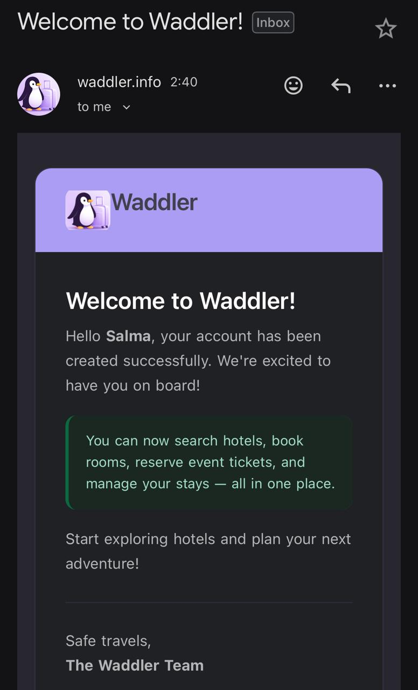
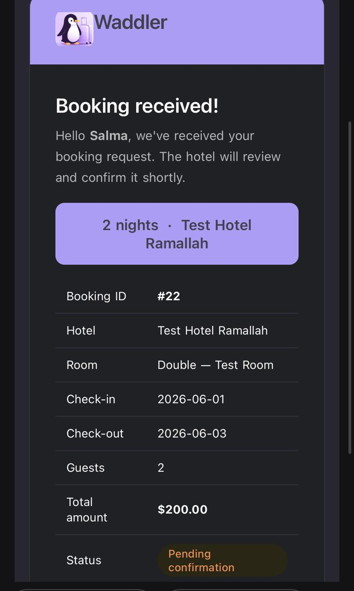
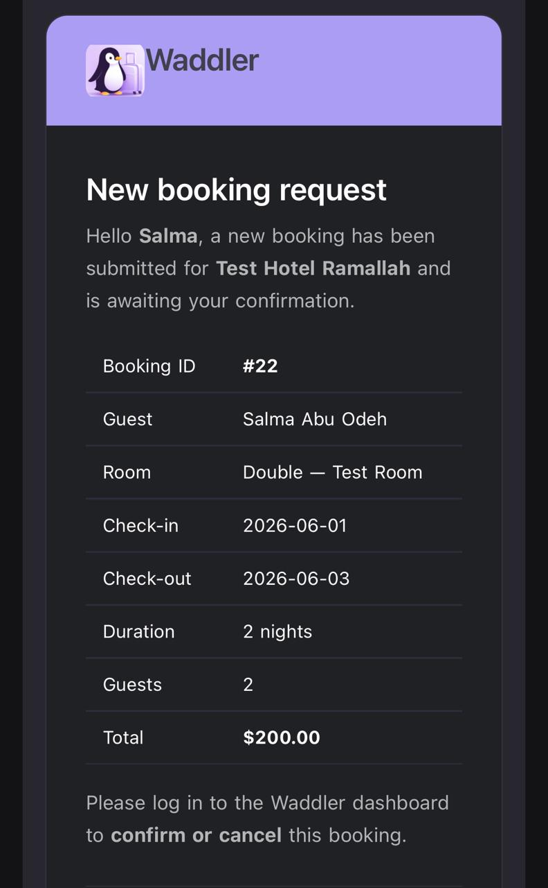
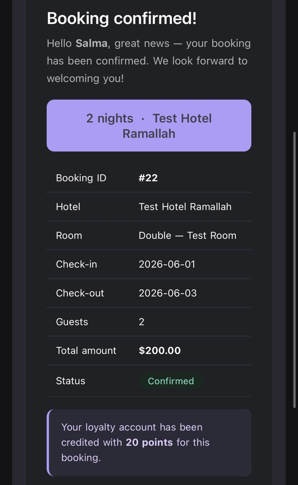
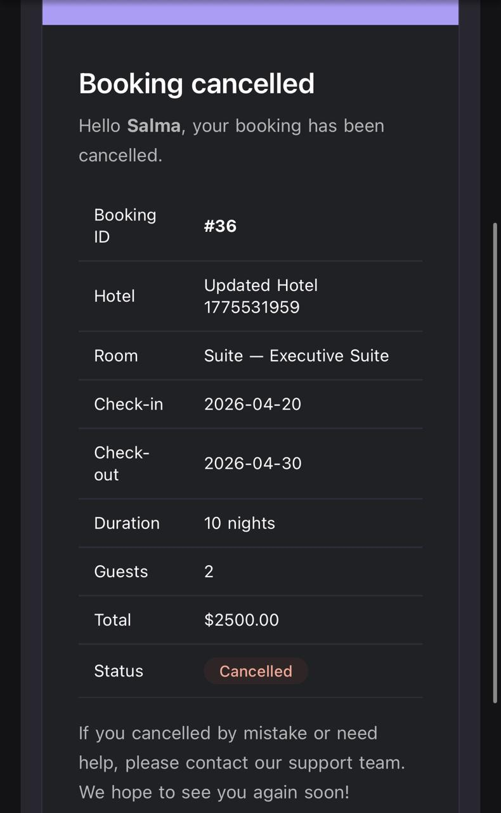
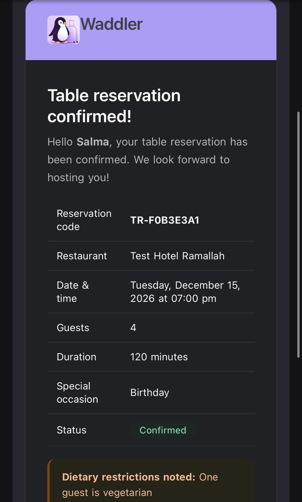
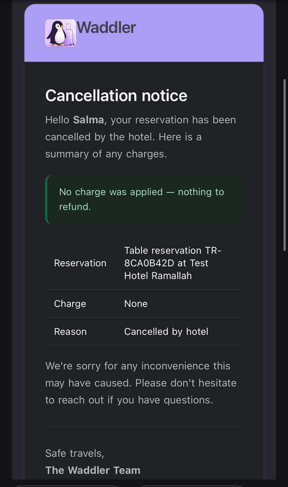
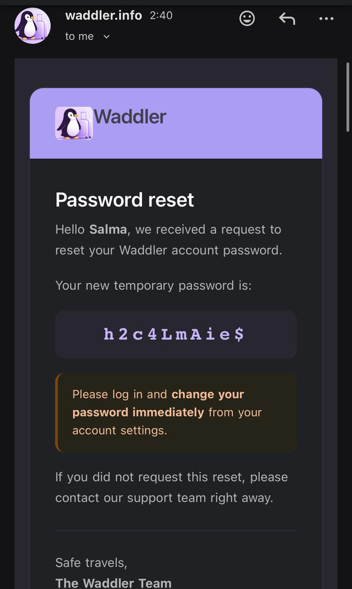
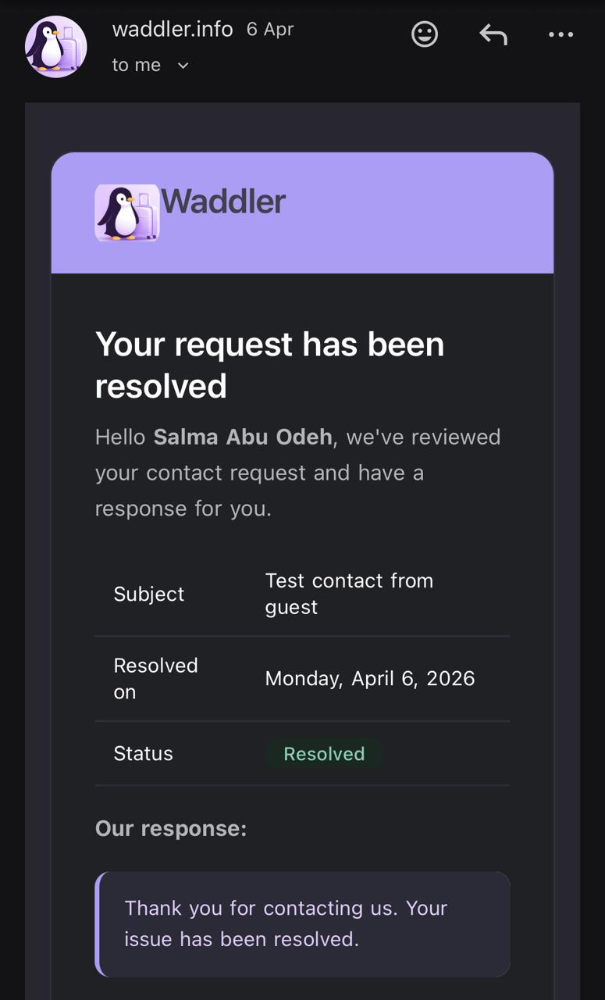

# 🐧 Waddler — Tourism Hotel Booking System

> **Team:** AbsoluteCinema  
> **Course:** SWER313 — Software Engineering Project  
> **Step:** 1 — Modular Monolith Implementation  
> **Architecture Evolution:** Modular Monolith → Microservices → Cloud Deployment

---

## Table of Contents

1. [Project Overview](#1-project-overview)
2. [Team](#2-team)
3. [Technology Stack](#3-technology-stack)
4. [System Architecture](#4-system-architecture)
5. [Core Modules](#5-core-modules)
6. [Design Patterns Used](#6-design-patterns-used)
7. [Getting Started](#7-getting-started)
8. [Postman Setup & Usage](#8-postman-setup--usage)
9. [Swagger / API Documentation](#9-swagger--api-documentation)
10. [Authentication & Authorization](#10-authentication--authorization)
11. [Email Notifications](#11-email-notifications)
12. [Unit Testing](#12-unit-testing)
13. [Business Logic Overview](#13-business-logic-overview)
14. [Database Schema Summary](#14-database-schema-summary)
15. [Future Microservices Strategy](#15-future-microservices-strategy)

---

## 1. Project Overview

**Waddler** is a comprehensive tourism and hotel booking platform that enables guests to search hotels, check room availability, create bookings, process payments, reserve restaurant tables, join events, and receive email notifications throughout the entire booking lifecycle.

Hotel managers can manage listings, rooms, pricing rules, events, and booking confirmations. Admins oversee the full system including license approvals, user management, and support requests.

### Key Features

- Hotel catalog with filtering, search, and pagination
- Real-time room availability and dynamic pricing engine
- Booking lifecycle management (PENDING → CONFIRMED → CHECKED_IN → CHECKED_OUT)
- Mock payment processing with multiple payment methods
- Event booking and table reservation management
- Loyalty points program with tier-based rewards
- Email notification system for all major booking events
- Review and rating system
- Contact/support system with admin responses
- Full Swagger/OpenAPI documentation
- Comprehensive unit test coverage across all modules

---

## 2. Team

**Team Name:** AbsoluteCinema

---

## 3. Technology Stack

| Layer | Technology |
|---|---|
| Language | Java 21 |
| Framework | Spring Boot 4.0.2 |
| Security | Spring Security + OAuth2 Resource Server (JWT) |
| Database | MySQL |
| ORM | Spring Data JPA / Hibernate |
| API Docs | SpringDoc OpenAPI 3 (Swagger UI) 2.8.6 |
| Email | Spring Boot Mail (SMTP) |
| Build Tool | Maven |
| Testing | JUnit 5, Mockito, Spring Boot Test |
| Utilities | Lombok |

---

## 4. System Architecture

The system is designed as a **modular monolith** — a single deployable Spring Boot application with clearly separated internal modules. Each module has its own controllers, services, repositories, entities, DTOs, and mappers. This design directly mirrors the microservices decomposition planned for Step 2.


### Module Boundaries

Each module follows clean architecture:

```
src/main/java/org/example/rest/
├── auth/           # Authentication & JWT
├── hotel/          # Hotel catalog management
├── room/           # Room types & inventory
├── booking/        # Booking lifecycle
├── payment/        # Payments & refunds
├── event/          # Hotel events
├── eventreservation/  # Event reservations
├── tablereservation/  # Restaurant table bookings
├── loyalty/        # Loyalty points & tiers
├── review/         # Reviews & ratings
├── contact/        # Support/contact requests
├── notification/   # Email notifications
├── inventory/      # Availability & stock
├── amenity/        # Hotel amenities
├── cancellationpolicy/ # Cancellation rules
└── security/       # JWT, auth entry point, etc.
```

---

## 5. Core Modules

### Auth Module
Handles JWT-based authentication, registration, login, and refresh tokens.

**Endpoints:** `POST /auth/login`, `POST /auth/signup`, `POST /auth/logout`, `GET /auth/me`, `POST /auth/refresh`

### Hotel Module
Full CRUD for hotel listings including license management and admin approval.

**Endpoints:** `GET /hotels`, `POST /hotels`, `GET /hotels/{id}`, `PATCH /admin/hotels/{id}/approve`

### Room Module
Room type management with capacity, pricing, and services.

**Endpoints:** `GET /hotels/{id}/room-types`, `POST /hotels/{id}/room-types`, `PUT /rooms/{id}`, `DELETE /rooms/{id}`

### Booking Module
Full booking lifecycle from creation through cancellation. Bookings are sent to the hotel manager for confirmation before becoming active.

**Endpoints:** `POST /bookings`, `GET /bookings/{id}`, `PATCH /bookings/{id}/cancel`, `GET /me/bookings`

### Payment Module
Mock payment processing with support for credit card, cash, loyalty points, and split payments.

**Endpoints:** `POST /payments`, `GET /me/payments`, `POST /payments/{id}/refund`

### Event Module
Hotel-hosted events (concerts, tours, workshops) with capacity and approval workflows.

**Endpoints:** `GET /events`, `POST /hotels/{id}/events`, `POST /events/{id}/reservations`

### Table Reservation Module
Restaurant table reservations linked to hotel stays, with special occasion support.

**Endpoints:** `POST /table-reservations`, `GET /me/table-reservations`, `DELETE /table-reservations/{id}`

### Loyalty Module
Points earning on bookings, tier management (Bronze → Silver → Gold → Platinum), and redemption.

**Endpoints:** `GET /me/loyalty`, `POST /me/loyalty/redeem`

### Review Module
Verified reviews for hotels and events. A user can only review after a confirmed booking/attendance.

**Endpoints:** `POST /hotels/{id}/reviews`, `GET /hotels/{id}/reviews`, `GET /hotels/{id}/reviews/summary`

### Contact Module
Guest-to-support messaging system. Admins can respond and mark requests as resolved.

**Endpoints:** `POST /contact`, `GET /admin/contact-requests`, `POST /admin/contact-requests/{id}/resolve`

### Notification Module
Internal service for email delivery. Tracks status, retries failed sends, and logs delivery.

**Endpoints:** `GET /me/notifications`, `PATCH /me/notifications/{id}/read`

### Inventory Module
Room availability tracking per date. Supports pessimistic locking to prevent double-booking.

**Endpoints:** `GET /availability/check`, `POST /inventory/lock`

### Cancellation Policy Module
Configurable refund rules based on days before check-in.

**Endpoints:** `GET /cancellation-policies`, `POST /admin/cancellation-policies`

---

## 6. Design Patterns Used

The backend uses six main design patterns to keep the modular monolith easier to extend, test, and later split into services.

| Pattern | Where It Is Used | Purpose |
|---|---|---|
| Observer | `BookingServiceImpl`, booking event classes, `BookingNotificationListener` | Booking state changes publish domain events, and listeners handle side effects such as emails and loyalty points without coupling them directly to booking logic. |
| Decorator | `payment/decorator/*`, `PaymentConfig`, `PaymentServiceImpl` | Payment behavior is extended through a validation chain: fraud checks, duplicate-payment prevention, and amount/split validation wrap the core payment service. |
| Strategy | `RoomPricingStrategy`, `BudgetPricingStrategy`, `LuxuryPricingStrategy`, `RangePricingStrategy`, `NoPricingStrategy` | Room search selects different pricing-filter behavior depending on the provided min/max price inputs. |
| Factory | `LoyaltyRewardFactory`, `LoyaltyReward` | Loyalty rewards are created from reward types in one central place, including booking points, group bonuses, and redemption rewards. |
| Singleton | `HotelConfigService` | Shared hotel configuration values, such as allowed sort fields and maximum gallery/amenity limits, are exposed through one application-wide instance. |
| Specification | `HotelSpecifications`, `BookingSpecification`, `PaymentSpecifications`, `RefundSpecifications`, and other `*Specification` classes | Dynamic filtering is built by composing reusable JPA `Specification` predicates for search, pagination, and admin/manager listing screens. |

---

## 7. Getting Started

### Prerequisites

- Java 21+
- Maven 3.8+
- MySQL 8.0+
- An SMTP email server (or Gmail with App Password)

### 1. Clone the Repository

```bash
git clone https://github.com/S26-SWER313/project-step-1-absolutecinema.git
cd project-step-1-absolutecinema
```

### 2. Configure the Database

Create a MySQL database:

```sql
CREATE DATABASE absolutecinema_db;
```

### 3. Configure `application.properties`

Edit `src/main/resources/application.properties`:

```properties
# Database
spring.datasource.url=jdbc:mysql://localhost:3306/absolutecinema_db?useSSL=false&allowPublicKeyRetrieval=true&serverTimezone=UTC
spring.datasource.username=root
spring.datasource.password=
spring.jpa.hibernate.ddl-auto=update

# JWT
security.jwt.secret=${JWT_SECRET}
security.jwt.secret.issuer=waddler
security.jwt.secret.access-token-minutes=60
security.jwt.refresh-token-days=7

# Email (SMTP)
spring.mail.host=smtp.gmail.com
spring.mail.port=587
spring.mail.username=waddler.info@gmail.com
spring.mail.password=oasa eudc uptr szzp
spring.mail.properties.mail.smtp.auth=true
spring.mail.properties.mail.smtp.starttls.enable=true
spring.mail.properties.mail.smtp.starttls.required=true
```

### 4. Build and Run

```bash
mvn clean install
mvn spring-boot:run
```

The server starts at: `http://localhost:8080`

---

## 8. Postman Setup & Usage

> ⚠️ **Important:** You must complete the setup steps below before testing any authenticated endpoints.

### Step 1: Import the Collection

Import the provided Postman collection file into Postman (`File → Import`).

### Step 2: Set Up Environment Variables

Create a new Postman environment with these variables:

| Variable        | Initial Value |
|-----------------|---|
| `base_url`      | `http://localhost:8080` |
| `adminToken`    | *(leave empty — auto-filled after login)* |
| `managerToken`  | *(leave empty — auto-filled after login)* |
| `userToken`     | *(leave empty — auto-filled after login)* |
| `refresh_token` | *(leave empty — auto-filled after login)* |

### Step 3: Register a User

Send a `POST` request to `/auth/signup` with your user details. Example body:

```json
{
  "email": "user@example.com",
  "username": "testuser",
  "password": "Password1!",
  "firstName": "Salma",
  "lastName": "Abu Odeh",
  "birthDate": "2000-01-01",
  "gender": "FEMALE"
}
```

### Step 4: Login & Get Token

Send `POST /auth/login`. The collection's **Tests** script auto-saves the returned JWT token to the `token` environment variable.

### Step 5: Use Authenticated Requests

All subsequent requests will automatically include the `Authorization: Bearer {{token}}` header.

### Recommended Testing Flow

1. `POST /auth/signup` — Register a user
2. `POST /auth/login` — Get JWT token
3. `POST /hotels` *(as HOTEL_MANAGER)* — Create a hotel
4. `POST /hotels/{id}/room-types` — Add rooms
5. `GET /availability/check` — Check availability
6. `POST /bookings` — Create a booking
7. `POST /payments` — Pay for the booking
8. `GET /me/bookings` — View your bookings
9. `PATCH /bookings/{id}/cancel` — Cancel if needed

> 💡 **Tip:** Some endpoints require the `HOTEL_MANAGER` or `ADMIN` role. Register separate accounts for each role during testing.

---

## 9. Swagger / API Documentation

Swagger UI is available at:

```
http://localhost:8080/swagger-ui.html
```

Or alternatively:

```
http://localhost:8080/swagger-ui/index.html
```

The OpenAPI JSON spec is at:

```
http://localhost:8080/v3/api-docs
```

### Using Swagger for Authenticated Requests

1. Open Swagger UI
2. Click **Authorize** (lock icon, top right)
3. Enter your JWT token in the format: `Bearer YOUR_TOKEN_HERE`
4. Click **Authorize** and close the dialog
5. All subsequent requests in Swagger will use your token

> Swagger documents all endpoints including request/response schemas, required fields, and HTTP status codes.

---

## 10. Authentication & Authorization

The system uses **JWT (JSON Web Token)** authentication via Spring Security and OAuth2 Resource Server.

### Roles

| Role | Description |
|---|---|
| `GUEST` | Unauthenticated users — read-only, paginated access |
| `USER` | Registered users — can book, review, manage profile |
| `HOTEL_MANAGER` | Manages hotel listings, rooms, events, and confirmations |
| `ADMIN` | Full system access including license approvals and user management |

### Token Details

- Tokens expire after **24 hours** (configurable via `jwt.expiration`)
- Use `POST /auth/refresh` with your refresh token to renew
- Token payload contains: user ID, username, email, role

---

## 11. Email Notifications

Waddler sends automated emails for all major lifecycle events. The notification system uses Spring Boot Mail with HTML templates.

### Email Types Sent

#### Welcome Email
Sent when a user creates an account.

> 📸 **Screenshot:** `docs/emails/welcome.jpeg`



---

#### Booking Received (Guest confirmation)
Sent to the guest when a booking is submitted, while the hotel reviews it.

> 📸 **Screenshot:** `docs/emails/send_booking.jpeg`



---

#### New Booking Request (Manager notification)
Sent to the hotel manager when a guest creates a booking that needs confirmation.

> 📸 **Screenshot:** `docs/emails/booking_sent_to_manager.jpeg`



---

#### Booking Confirmed
Sent to the guest when the hotel manager confirms the booking. Includes loyalty points earned.

> 📸 **Screenshot:** `docs/emails/manager_confirmed_booking.jpeg`



---

#### Booking Cancelled
Sent when a booking is cancelled (either by the guest or hotel). Includes cancellation reason and refund info.

> 📸 **Screenshot:** `docs/emails/booking_cancelled.jpeg`



---

#### Table Reservation Confirmed
Sent when a restaurant table reservation is confirmed, including dietary restriction notes.

> 📸 **Screenshot:** `docs/emails/table_reservation_confirmed.jpeg`



---

#### Table Reservation Cancelled
Sent when a table reservation is cancelled by the hotel, including charge summary.

> 📸 **Screenshot:** `docs/emails/table_reservation_cancelled.jpeg`



---

#### Password Reset
Sent when a user requests a password reset. Includes a temporary password and a security warning.

> 📸 **Screenshot:** `docs/emails/forgot_password.jpeg`



---

#### Contact Request Resolved
Sent to the user when support has responded to their contact/help request.

> 📸 **Screenshot:** `docs/emails/contact_us.jpeg`



---


## 12. Unit Testing

All service-layer modules have dedicated unit tests using **JUnit 5** and **Mockito**.

### Covered Modules

| Test Class | Module Tested |
|---|---|
| `AuthServiceTest` | Authentication & registration |
| `AuthIntegrationTest` | Full auth flow (integration) |
| `JwtTokenServiceTest` | JWT token generation & validation |
| `RefreshTokenServiceTest` | Token refresh logic |
| `SecurityUtilTest` | Security context utilities |
| `AuthorizationServiceTest` | Role-based access checks |
| `AuthEntryPointJwtTest` | Unauthorized entry point |
| `CustomUserDetailsServiceTest` | UserDetails loading |
| `HotelServiceImplTest` | Hotel CRUD and license flow |
| `RoomServiceImplTest` | Room type management |
| `BookingServiceImplTest` | Booking lifecycle |
| `PaymentServiceImplTest` | Payment processing |
| `RefundServiceImplTest` | Refund calculation & processing |
| `InventoryServiceImplTest` | Availability & locking |
| `PricingRuleServiceImplTest` | Dynamic pricing rules |
| `CancellationPolicyServiceImplTest` | Refund policy evaluation |
| `EventServiceImplTest` | Event management |
| `EventReservationServiceImplTest` | Event reservation logic |
| `TableReservationServiceImplTest` | Table booking logic |
| `LoyaltyServiceImplTest` | Points earning & redemption |
| `ReviewServiceImplTest` | Review eligibility & creation |
| `ContactServiceImplTest` | Contact/support system |
| `amenityServiceImplTest` | Amenity management |
| `RestApplicationTests` | Spring context load test |

**Total: 24 test classes** covering all major modules.

### Running Tests

```bash
# Run all tests
mvn test

# Run a specific test class
mvn test -Dtest=BookingServiceImplTest

# Run with coverage report
mvn test jacoco:report
```

Test reports are generated in `target/surefire-reports/`.

### Testing Approach

- **Service layer** tests use Mockito to mock repositories and dependencies
- **Integration tests** (`AuthIntegrationTest`) run with the full Spring context
- **Business logic** tested includes: pricing calculations, cancellation refunds, loyalty point rules, and availability checks
- **Error scenarios** are explicitly tested: invalid credentials, room conflicts, insufficient points, unauthorized access

---

## 13. Business Logic Overview

### Booking Flow

```
Guest creates booking → Status: PENDING
  ↓
Manager receives email notification
  ↓
Manager confirms → Status: CONFIRMED → Guest receives confirmation email
  ↓
Guest checks in → Status: CHECKED_IN
  ↓
Guest checks out → Status: CHECKED_OUT
```

### Cancellation & Refunds

Refund percentage is determined by **how many days before check-in** the cancellation occurs, based on the hotel's configured cancellation policy.

### Loyalty Points

- Earned: `floor(totalPaid / 10)` → 1 point per $10 spent
- Redeemed: 100 points = $1 discount
- Tiers: Bronze (0–999) → Silver (1,000–4,999) → Gold (5,000–19,999) → Platinum (20,000+)
- Points are reversed proportionally on cancellation

### Dynamic Pricing

Pricing rules support percentage or fixed modifiers, with configurable priority. Rules can target weekends, seasons, holidays, or demand-based scenarios.

### Double-Booking Prevention

The system uses **pessimistic locking** on inventory records during booking creation. Room locks expire after 15 minutes if not converted into a confirmed booking.

---

## 14. Database Schema Summary

The system uses **MySQL** with the following primary table groups:

| Group | Tables                                                              |
|---|---------------------------------------------------------------------|
| Users & Auth | `user`, `refresh_token`, `loyalty_account`, `loyalty_transaction`   |
| Catalog | `hotel`, `room`, `amenitie`|
| Availability | `inventory`, `pricing_rule`                                     |
| Bookings | `booking`, `cancellation_policie`                       |
| Events| `event`, `event_reservation`                           |
| Restaurants | `restaurant`, `table_reservation`                                   |
| Payments | `payment`, `refund`                                                 |
| Content | `review`                                         |
| System | `notification`                   |
| Support | `contact`                                                           |

Schema is auto-managed by Hibernate (`spring.jpa.hibernate.ddl-auto=update`).

---

## 15. Future Microservices Strategy

This modular monolith is designed to be split into microservices in Step 2. Planned decomposition:

| Microservice | Responsibility |
|---|---|
| Catalog Service | Hotels, rooms, amenities, locations |
| Availability Service | Inventory, pricing, room locking |
| Booking Service | Booking lifecycle, cancellation policies |
| Payment Service | Payments, refunds, transactions |
| Notification Service | Email, SMS, push notifications |
| Review Service | Reviews and ratings |
| Loyalty Service | Points and tier management |
| Event Service | Events and reservations |

**Inter-service communication** will use REST for synchronous calls and RabbitMQ for asynchronous events (e.g., booking confirmed → notify service).

---

## Configuration Reference

### Environment Variables

| Variable | Description | Default             |
|---|---|---------------------|
| `DB_HOST` | MySQL host | `localhost`         |
| `DB_PORT` | MySQL port | `3306`              |
| `DB_NAME` | Database name | `absolutecinema_db` |
| `DB_USERNAME` | DB username | root                |
| `DB_PASSWORD` | DB password | —                   |
| `JWT_SECRET` | JWT signing key (min 256-bit) | —                   |
| `JWT_EXPIRATION` | Token TTL in ms | `86400000`          |
| `SMTP_HOST` | Mail server host | `smtp.gmail.com`    |
| `SMTP_PORT` | Mail server port | `587`               |
| `SMTP_USERNAME` | Sender email | —                   |
| `SMTP_PASSWORD` | App password | —                   |

---

*Built with ❤️ by Team AbsoluteCinema*
